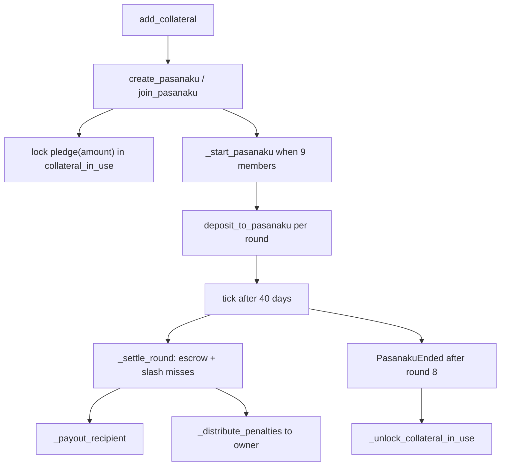

# Protocol lifecycle

Pasanaku runs an onchain rotating savings pool: participants fund collateral, join a nine-member pool, deposit each round, and permissionless ticks settle payouts until the pool ends and pledged collateral unlocks.

## Legend

| Node | Contract surface |
|------|------------------|
| `add_collateral` | `add_collateral(asset, amount)` — credit collateral ledger and pull ERC20 |
| `create_pasanaku / join_pasanaku` | `create_pasanaku(asset, amount)` · `join_pasanaku(token_id)` |
| `lock pledge(amount)` | `_update_collateral_in_use` · view `pledge(amount)` |
| `_start_pasanaku when 9 members` | Internal start on ninth join; mints ERC1155 membership |
| `deposit_to_pasanaku per round` | `deposit_to_pasanaku(amount, token_id)` — obligor escrow |
| `tick after 40 days` | `tick(token_id)` once `updated + 40 days` elapsed |
| `_settle_round` | Internal — credit recipient payout, slash misses |
| `_payout_recipient` | Internal — transfer principal to round recipient |
| `_distribute_penalties to owner` | Internal — miss penalties to `owner()` |
| `PasanakuEnded after round 8` | Final tick when `round_idx == 8` |
| `_unlock_collateral_in_use` | Internal — release pledged collateral per participant |

If this document and the implementation disagree, **`src/Pasanaku.vy` is canonical** (see also `CONTEXT.md`).
